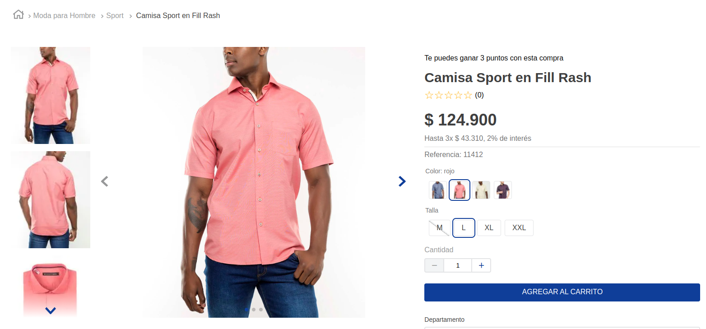

# Point per purchase Component

<!-- DOCS-IGNORE:start -->
<!-- ALL-CONTRIBUTORS-BADGE:START - Do not remove or modify this section -->

[](#contributors-)

<!-- ALL-CONTRIBUTORS-BADGE:END -->
<!-- DOCS-IGNORE:end -->

With this component you can view the result of the points assigned for the purchase of a product. This component is used in the `product-summary.shelf` and `store.product` blocks




## Configuration

To configure this component, you must follow these steps.

### Adding the app as a theme dependency

In your theme's manifest.json, add the Third Price Component app as a dependency:

```json
"dependencies": {
  "itglobers.points-per-purchase": "0.x"
}
```

Now, you can use all the blocks exported by the points-per-purchase app.

For the product page add the component in `store.product` in this because we added it next to the product name like in the example.

```json
  "flex-layout.col#right-col": {
    "props": {
      "preventVerticalStretch": true,
      "rowGap": 0
    },
    "children": [
      "points-per-purchase",
      "flex-layout.row#product-name",
      "product-rating-summary",
      "flex-layout.row#list-price-savings",
      "flex-layout.row#selling-price",
      "product-installments",
      "product-separator",
      "product-identifier.product",
      "sku-selector",
      "product-quantity",
      "product-assembly-options",
      "product-gifts",
      "flex-layout.row#buy-button",
      "availability-subscriber",
      "shipping-simulator",
      "share#default"
    ]
  },

  "points-per-purchase": {
    "props": {
      "basePoint": 500,
      "quantityPoint": 1
    }
  },
```

To include it in a shelf add the component in `product-summary.shelf` in this case we add it next to the product name as in the example.

```json
  {
  "product-summary.shelf": {
    "children": [
      "stack-layout#prodsum",
      "product-summary-name",
      "points-per-purchase",
      "flex-layout.col#productRating",
      "product-summary-space",
      "product-summary-sku-selector",
      "product-list-price#summary",
      "flex-layout.row#selling-price-savings",
      "product-installments#summary",
      "add-to-cart-button"
    ]
  },
  "points-per-purchase": {
    "props": {
      "basePoint": 500,
      "quantityPoint": 1
    }
  },
```

### setting variables from the site editor

The values ​​of the purchase base and the number of points are configurable from the site editor


### `third-price-component` props

| Prop name       | Type     | Description                                                         | Default value |
| --------------- | -------- | ------------------------------------------------------------------- | ------------- |
| `basePoint`     | `number` | This is the basis in pesos for which points will be awarded.        | 500           |
| `quantityPoint` | `number` | Points that will be awarded for the result of the purchase based on | 1             |

<!-- DOCS-IGNORE:start -->

## Contributors ✨

Thanks goes to these wonderful people:

<!-- ALL-CONTRIBUTORS-LIST:START - Do not remove or modify this section -->
<!-- prettier-ignore-start -->
<!-- markdownlint-disable -->
<!-- markdownlint-enable -->
<!-- prettier-ignore-end -->

<!-- ALL-CONTRIBUTORS-LIST:END -->

This project follows the [all-contributors](https://github.com/all-contributors/all-contributors) specification. Contributions of any kind are welcome!

<!-- DOCS-IGNORE:end -->
